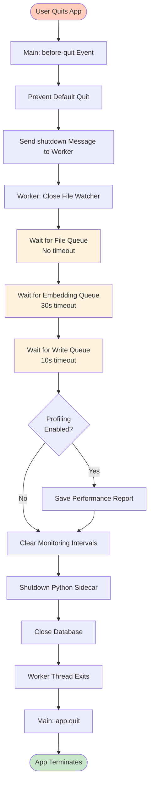

# App Startup Flow

*Previous: [07-signing-distribution.md](./07-signing-distribution.md)*

---

## Complete Flow from Startup to Ready

```mermaid
graph TD
    Start([App Starts]) --> MainProcess[Main Process: main.ts]

    MainProcess --> CreateWindow[Create Browser Window]
    MainProcess --> SpawnWorker[Spawn Worker Thread]

    CreateWindow --> LoadUI[Load React App]

    SpawnWorker --> Stage1[Stage 1: worker_spawn]
    Stage1 --> InitWorker[Worker: Initialize Startup]

    InitWorker --> Stage2[Stage 2: sidecar_start]
    Stage2 --> StartSidecar[PythonSidecarService.startSidecar]

    StartSidecar --> CheckDeps[Check Python Dependencies]
    CheckDeps --> SpawnPython[Spawn Python Process]
    SpawnPython --> CheckCache{Model in Cache?}

    CheckCache -->|Yes| Stage3b[SKIP Stage 3]
    CheckCache -->|No| Stage3[Stage 3: downloading]

    Stage3 --> DownloadModel[Python: Download Model<br/>from HuggingFace]
    DownloadModel --> EmitProgress[Emit PROGRESS events]
    EmitProgress --> UIUpdate[Update Progress Bar]

    Stage3b --> Stage4[Stage 4: sidecar_ready]
    DownloadModel --> Stage4

    Stage4 --> LoadModel[Python: Load Model<br/>into Memory]
    LoadModel --> HealthCheck[Health Check Pass]

    HealthCheck --> Stage5[Stage 5: embedder_init]
    Stage5 --> InitEmbedder[Create PythonSidecarEmbedder]
    InitEmbedder --> EmbedderReady[Embedder Ready]

    EmbedderReady --> Stage6[Stage 6: db_init]
    Stage6 --> InitDB[Initialize LanceDB]

    InitDB --> Stage7[Stage 7: db_load]
    Stage7 --> LoadFiles[Load File Status]

    LoadFiles --> Stage8[Stage 8: folder_scan]
    Stage8 --> ScanFolders[Scan Watched Folders]

    ScanFolders --> Stage9[Stage 9: ready]
    Stage9 --> HideOverlay[Hide Progress Overlay]
    HideOverlay --> ShowMainUI[Show Search UI]

    ShowMainUI --> ProcessFiles[Background: Process File Queue]
    ProcessFiles --> ParseFile[Parse Document]
    ParseFile --> ChunkText[Chunk Text]
    ChunkText --> EmbedText[HTTP POST /embed]

    EmbedText --> PythonSidecar[Python Sidecar:<br/>Generate Embeddings]
    PythonSidecar --> ReturnVectors[Return Vectors]
    ReturnVectors --> SaveToDB[Save to LanceDB]
    SaveToDB --> NextFile[Process Next File]
    NextFile --> ProcessFiles

    LoadUI --> AppComponent[App.tsx Component Mounts]
    AppComponent --> ShowProgress[Show Startup Progress]
    ShowProgress --> ListenStages[Listen for startup:stage Events]
    ListenStages --> UpdateUI[Update Progress Bar:<br/>11% → 22% → ... → 100%]

    style Start fill:#e1f5e1
    style ShowMainUI fill:#e1f5e1
    style Stage9 fill:#e1f5e1
    style Stage6 fill:#ffe0b2
    style DownloadModel fill:#ffccbc
    style CheckCache fill:#fff3e0
```



## Startup Stages

The app progresses through 9 sequential stages, with progress bar updating at each step:

| Stage | ID | Description | Progress |
|-------|------|-------------|----------|
| 1 | `worker_spawn` | Worker thread starts | 11% |
| 2 | `sidecar_start` | Check Python deps + start sidecar | 22% |
| 3 | `downloading` | Download model (first run only) | 33% |
| 4 | `sidecar_ready` | Load model into memory | 44% |
| 5 | `embedder_init` | Initialize embedder | 55% |
| 6 | `db_init` | Initialize LanceDB | 66% |
| 7 | `db_load` | Load file status | 77% |
| 8 | `folder_scan` | Scan watched folders | 88% |
| 9 | `ready` | Application ready | 100% |

**Note:** Stage 3 (`downloading`) is **automatically skipped** if model is already cached.

**Benefit:** Python dependency check happens early (stage 2), so users discover Python issues in ~500ms instead of waiting 3-5 seconds through DB initialization first.

## Key Components

### 1. **Main Process** (`src/main/main.ts`)
- Creates Electron window
- Spawns worker thread
- Routes IPC messages between renderer and worker
- Forwards `startup:stage` events to renderer

### 2. **Renderer Process** (`src/renderer/App.tsx`)
- Shows startup progress overlay with progress bar
- Listens for `startup:stage` IPC events
- Calculates progress: `(stageIndex + 1) / 9 * 100`
- Hides overlay when stage reaches `ready`

### 3. **Worker Thread** (`src/main/worker/index.ts`)
- Orchestrates entire startup sequence
- Manages PythonSidecarService
- Emits stage updates via `parentPort.postMessage()`
- Handles file processing queue after startup

### 4. **WorkerStartup** (`src/main/worker/WorkerStartup.ts`)
- State machine for initialization sequence
- Manages 9 startup stages sequentially
- Listens for Python sidecar progress events
- Emits `startup:stage` and `startup:error` messages

### 5. **PythonSidecarService** (`src/main/worker/PythonSidecarService.ts`)
- Manages Python child process lifecycle
- Spawns `embed_server.py` on port 8421
- Parses PROGRESS events from Python stdout
- Provides health checks and auto-restart

### 6. **Python Sidecar** (`embedding_sidecar/embed_server.py`)
- FastAPI HTTP server for embeddings
- Loads sentence-transformers model
- Emits progress events during model loading:
  - `PROGRESS:{"type":"model_cached","data":{...}}`
  - `PROGRESS:{"type":"download_started","data":{...}}`
  - `PROGRESS:{"type":"model_loaded","data":{...}}`

## UI Components

### StartupProgress.tsx

Simple progress bar overlay showing initialization progress:

```
┌───────────────────────────────────────────────────────┐
│                                                       │
│              Initializing Semantica                   │
│                                                       │
│         Starting Python sidecar server...             │
│                                                       │
│  ████████████████████████████░░░░░░░░░░░░░░░░░░░░   │  ← 55%
│                                                       │
└───────────────────────────────────────────────────────┘
```

**Features:**
- Horizontal progress bar (8px height)
- Blue gradient fill with shimmer animation
- Stage-specific message above bar
- Smooth 0.5s transitions

**Stage Messages:**
- "Starting worker process..."
- "Initializing database..."
- "Loading indexed files..."
- "Scanning folders..."
- "Starting Python sidecar server..."
- "Downloading embedding model..." *(first run only)*
- "Loading embedding model..."
- "Initializing embedder..."
- "Ready!"

## Critical Flows

### First-Time User (No Model Cached)

1. App starts → All 9 stages execute
2. Stage 6 visible: "Downloading embedding model..."
3. Python downloads ~450MB from HuggingFace
4. Model cached at `~/.cache/huggingface/hub/`
5. Progress bar reaches 100% → Hide overlay
6. Show main UI → Start indexing

**Timeline:** ~2-5 minutes (network dependent)

### Returning User (Model Cached)

1. App starts → Stages 1-5 execute
2. **Stage 6 skipped** (model in cache)
3. Stages 7-9 execute quickly
4. Progress bar reaches 100% → Hide overlay
5. Show main UI → Start indexing

**Timeline:** ~3-5 seconds

### File Processing (After Startup)

1. Queue waits for `ready` stage
2. Once ready, processes files continuously
3. Each file: **Parse → Chunk → HTTP POST → Save**
4. HTTP call to Python sidecar: `POST http://127.0.0.1:8421/embed`
5. Python returns vectors → Save to LanceDB

### Page Reload / Wake from Sleep

**Issue:** Race condition where startup overlay briefly appears when worker already ready.

**Scenario:**
1. App fully initialized and running
2. User reloads page (Cmd+R) or Mac wakes from sleep
3. Renderer process reloads, but worker thread stays alive
4. Startup overlay flashes briefly before recognizing worker is ready

**Solution: Dual-Layer Defense**

The app implements two defensive checks to prevent the overlay from appearing unnecessarily:

**Layer 1: Pre-render Check (App.tsx)**
```typescript
const [isCheckingWorkerStatus, setIsCheckingWorkerStatus] = useState(true);

useEffect(() => {
  const checkWorkerReady = async () => {
    const isReady = await window.api.worker.isReady();
    if (isReady) {
      setAppReady(true);
    }
    setIsCheckingWorkerStatus(false);
  };
  checkWorkerReady();
}, []);

// Only render overlay after check completes
{!isCheckingWorkerStatus && !appReady && (
  <StartupProgress onComplete={handleStartupComplete} />
)}
```

**Benefits:**
- Prevents overlay from rendering until worker status confirmed
- Eliminates flash when worker already ready
- Fast check (~5-10ms)

**Layer 2: Immediate Completion (StartupProgress.tsx)**
```typescript
useEffect(() => {
  const checkWorkerReady = async () => {
    const isReady = await window.api.worker.isReady();
    if (isReady && mounted) {
      // Worker is already ready, complete immediately
      onComplete();
      return;
    }
    // Otherwise, listen for startup:stage events
    // ...
  };
  checkWorkerReady();
}, []);
```

**Benefits:**
- Redundant safety check if overlay does render
- Completes immediately without waiting for events
- Handles edge cases where Layer 1 might miss

**Performance:**
- Check completes in 5-10ms
- No impact on cold startup (worker not ready)
- Seamless experience on reload/wake

## Python Sidecar Progress Events

The Python sidecar emits progress events via stdout during model loading:

### Event Format

```
PROGRESS:{"type":"<event_type>","data":{...}}
```

### Event Types

#### `model_cached`
Model already downloaded, loading from cache.

```json
{
  "type": "model_cached",
  "data": {
    "model": "paraphrase-multilingual-mpnet-base-v2"
  }
}
```

**Effect:** Stage 6 (`downloading`) is **skipped**

#### `download_started`
First run - model needs to be downloaded.

```json
{
  "type": "download_started",
  "data": {
    "model": "paraphrase-multilingual-mpnet-base-v2"
  }
}
```

**Effect:** Triggers Stage 6 (`downloading`)

#### `model_loaded`
Model successfully loaded into memory.

```json
{
  "type": "model_loaded",
  "data": {
    "model": "paraphrase-multilingual-mpnet-base-v2",
    "dimensions": 768
  }
}
```

**Effect:** Proceeds to Stage 7 (`sidecar_ready`)

## Shutdown Flow

### Graceful Shutdown Sequence

When the app is quit, the system performs a coordinated shutdown to ensure no data loss:



### Shutdown Orchestration

The shutdown process is coordinated by `src/main/worker/shutdown/orchestrator.ts`, which provides:

**8-Step Process:**
1. **Close watcher** - Stop accepting new files
2. **File queue drain** - Wait for all files to complete processing (no timeout)
3. **Embedding queue drain** - Wait for embeddings to complete (30s timeout)
4. **Write queue drain** - Wait for database writes to complete (10s timeout)
5. **Profiling report** - Generate performance report (if enabled)
6. **Clear intervals** - Stop health check and memory monitoring
7. **Sidecar shutdown** - Gracefully stop Python embedding service
8. **Database close** - Close LanceDB connection

**Key Features:**
- **Pure function design**: Testable, modular shutdown logic
- **Configurable timeouts**: Prevent indefinite hangs
- **Progress callbacks**: Real-time visibility into shutdown steps
- **Detailed results**: Per-step success/failure reporting
- **Non-blocking timeouts**: Queue timeouts don't prevent full shutdown

### Queue Draining

The `shutdown/queueDrainer.ts` module provides a generic, pure async function for waiting on any queue:

**Features:**
- Configurable timeout and poll interval
- Generic queue statistics interface
- Custom empty-check predicates
- Progress callbacks for monitoring
- Highly testable (pure function)

**Usage Example:**
```typescript
const drained = await waitForQueueToDrain({
  queueName: 'embedding_queue',
  getStats: () => embeddingQueue.getStats(),
  isQueueEmpty: (stats) => stats.queueDepth === 0 && stats.processingBatches === 0,
  timeoutMs: 30000,
  onProgress: (stats, elapsed) => logger.log(`Queue: ${stats.queueDepth}`)
});
```

### Timeout Handling

**File Queue:** No timeout - ensures all discovered files are processed before shutdown

**Embedding Queue:** 30s timeout - balances data integrity with reasonable shutdown time

**Write Queue:** 10s timeout - database writes are critical, but must bound shutdown time

**Timeout behavior:** If a queue times out, the shutdown continues (fails gracefully) but logs the timeout. This prevents the app from hanging indefinitely while still attempting to complete critical operations.

### Worker Exit Protocol

**Normal flow:**
1. Worker completes all shutdown steps
2. Returns `ShutdownResult` to main process
3. Exits worker thread cleanly

**Timeout fallback:**
1. Main process waits 3s for worker exit
2. If worker doesn't exit, main process forces quit
3. Prevents indefinite hang on shutdown

## IPC Message Protocol

### Worker → Main → Renderer

```typescript
interface StartupStageMessage {
  channel: 'startup:stage';
  stage: StartupStage;
  message?: string;
  progress?: number;
}
```

**Example:**
```typescript
{
  channel: 'startup:stage',
  stage: 'downloading',
  message: 'Downloading embedding model (paraphrase-multilingual-mpnet-base-v2)...',
  progress: undefined
}
```

### Error Messages

```typescript
interface StartupErrorMessage {
  channel: 'startup:error';
  code: StartupErrorCode;
  message: string;
  details?: unknown;
}
```

**Error Codes:**
- `PYTHON_NOT_FOUND` - Python interpreter not found in PATH
- `PYTHON_DEPS_MISSING` - Required Python dependencies not installed
- `PYTHON_VERSION_INCOMPATIBLE` - Python version < 3.9
- `SIDECAR_START_FAILED` - Failed to start Python process
- `SIDECAR_NOT_HEALTHY` - Health check failed
- `EMBEDDER_INIT_FAILED` - Embedder initialization failed
- `STARTUP_TIMEOUT` - Startup exceeded timeout

### Worker Status Check

**New in v1.0.3+:** Added to fix reload/wake race condition.

```typescript
ipcMain.handle('worker:isReady', async () => {
  return workerReady;
});
```

**Returns:** `boolean` - `true` if worker initialized and reached 'ready' stage

**Usage:** Called by renderer on mount to prevent showing startup overlay when worker already ready. Used in both `App.tsx` and `StartupProgress.tsx` for dual-layer defense.

**Implementation:**
```typescript
// In main.ts
let workerReady = false; // Set to true when worker reaches 'ready' stage

// In App.tsx
const isReady = await window.api.worker.isReady();

// In StartupProgress.tsx
const isReady = await window.api.worker.isReady();
if (isReady) {
  onComplete(); // Hide overlay immediately
}
```

## Important Notes

1. **Sequential Stages**: Stages execute in strict order, one at a time
2. **Conditional Stage**: Stage 6 (`downloading`) skipped if model cached
3. **Progress Calculation**: `(stageIndex + 1) / 9 * 100`
4. **HTTP Communication**: Python sidecar uses REST API (not IPC)
5. **Auto-Restart**: Python sidecar auto-restarts on crash (2s delay)
6. **Model Location**: `~/.cache/huggingface/hub/models--sentence-transformers--paraphrase-multilingual-mpnet-base-v2/`
7. **Port**: Python sidecar runs on `http://127.0.0.1:8421`

## Error Handling

### Python Environment Errors

**Pre-flight Dependency Check:**
- Runs before spawning Python process (~3.5s)
- Validates all required dependencies: `fastapi`, `uvicorn`, `pydantic`, `sentence-transformers`, `torch`, `pypdf`
- Returns detailed status: Python version, installed deps, missing deps

**Virtual Environment Detection:**
- Auto-detects `.venv` in `embedding_sidecar/` directory
- Falls back to system `python3` with context-aware warnings
- Development: Shows venv setup instructions
- Production: Shows global pip install instructions

**Context-Aware Error Messages:**
- Development mode: Recommends creating virtual environment
  ```
  cd embedding_sidecar && python3 -m venv .venv && source .venv/bin/activate && pip install -r requirements.txt
  ```
- Production mode: Shows global installation command
  ```
  pip3 install fastapi uvicorn pydantic sentence-transformers torch pypdf
  ```

**Auto-Restart Protection:**
- Max 3 restart attempts before disabling auto-restart
- Prevents infinite restart loops
- Shows diagnostic help after max restarts exceeded

### General Error Handling

- **Python spawn fails** → Show error with Retry button
- **Health check fails** → Retry with exponential backoff
- **Model download fails** → Show error, allow retry
- **Timeout** → After 30s, show error
- **Worker crashes** → Main process restarts worker thread

## Performance

**Startup Time:**
- First run (with download): 2-5 minutes
- Subsequent runs: 3-5 seconds
- Database init: ~500ms
- Python sidecar startup: ~2-3s
- Model loading: ~1-2s

**Memory Usage:**
- Main process: ~100MB
- Renderer: ~80MB
- Worker thread: ~400-600MB
- Python sidecar: ~400-600MB (stable)
- **Total:** ~1.2-1.9GB
