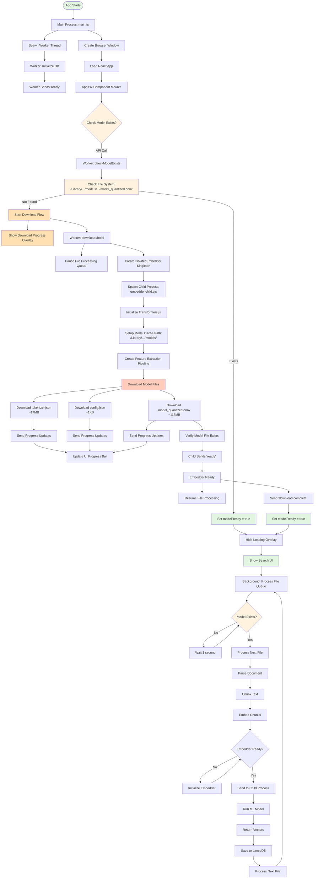

# App Startup Flow

*Previous: [07-signing-distribution.md](./07-signing-distribution.md)*

---

## Complete Flow from Startup to Ready

## Key Components

### 1. **Main Process** (`src/main/main.ts`)
- Creates Electron window
- Spawns worker thread
- Handles IPC communication
- Routes messages between renderer and worker

### 2. **Renderer Process** (`src/renderer/App.tsx`)
- Shows UI (search interface)
- Displays loading overlay during model check
- Shows download progress if model missing
- Removes overlay when ready

### 3. **Worker Thread** (`src/main/worker/index.ts`)
- Manages database (LanceDB)
- Handles file processing queue
- Coordinates model checking/downloading
- **KEY**: Won't process files until model exists

### 4. **Isolated Embedder** (`src/shared/embeddings/isolated.ts`)
- Singleton pattern (only ONE instance)
- Spawns child process for embeddings
- Manages memory by restarting child periodically
- Forwards download progress to UI

### 5. **Embedder Child Process** (`src/main/worker/embedder.child.ts`)
- Runs Transformers.js
- Downloads model files if missing
- Performs actual embeddings
- Isolated to prevent memory leaks

## Critical Flows

### First-Time User (No Model)
1. App starts → Check model → Not found
2. Show download overlay with progress
3. Download ~136MB of model files
4. Verify download → Hide overlay
5. Show main UI → Start indexing

### Returning User (Model Exists)
1. App starts → Check model → Found
2. Brief "Loading..." overlay (< 1 second)
3. Hide overlay → Show main UI
4. Background indexing continues

### File Processing
- Queue waits for model to exist
- Checks every 1 second until ready
- Once ready, processes files continuously
- Each file: Parse → Chunk → Embed → Save

## Important Notes

1. **Singleton Pattern**: Only ONE embedder instance exists globally
2. **Queue Blocking**: File processing blocked until model ready
3. **Progress Updates**: Download progress forwarded through Worker → Main → Renderer
4. **Memory Management**: Child process restarts after ~500 files
5. **Model Location**: `/Users/[user]/Library/Application Support/Semantica/models/`

## Error Handling

- Model check fails → Retry once after 1 second
- Download fails → Show error with retry button
- Child process crashes → Auto-restart
- Worker crashes → Main process restarts it