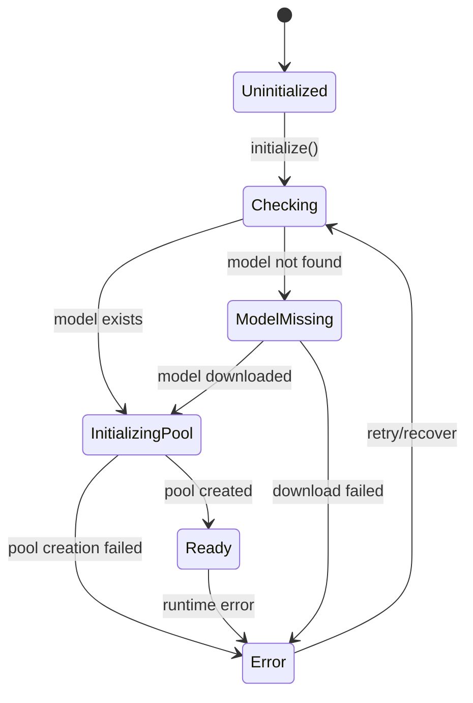

# Worker Service Architecture

## Overview

This document describes the refactored worker thread architecture, transitioning from a monolithic 1,700-line file to a modular, service-oriented design with clear separation of concerns.

## Problem Statement

The original `worker/index.ts` had grown to over 1,700 lines and exhibited several issues:

1. **Poor Testability**: Tightly coupled code made unit testing nearly impossible without extensive mocking
2. **Difficult Maintenance**: Finding specific functionality required scrolling through hundreds of lines
3. **High Cognitive Load**: Understanding the full system required holding too much context in memory
4. **Slow Startup**: All operations initialized synchronously, causing 10+ second startup times
5. **No Clear Boundaries**: Database, file watching, queueing, and ML operations were intermingled

## Solution: Service-Oriented Architecture

### Core Principles

1. **Single Responsibility**: Each service handles one specific domain
2. **Dependency Injection**: Services receive dependencies through constructors or setters
3. **Interface-Based**: All services implement well-defined interfaces
4. **Minimal Coupling**: Services communicate through events and method calls, not shared state
5. **Progressive Enhancement**: Fast operations complete first, slow operations continue in background

### Service Breakdown

#### 1. DatabaseService
- **Responsibility**: All LanceDB operations
- **Key Methods**: `connect()`, `disconnect()`, `getChunksTable()`, `queryFiles()`, `updateFileStatus()`
- **Dependencies**: None (pure I/O service)
- **Testing Strategy**: In-memory database or temp directory

#### 2. FileWatcherService
- **Responsibility**: File system monitoring with Chokidar
- **Key Methods**: `start()`, `stop()`, `scanForChanges()`
- **Events**: `add`, `change`, `unlink`
- **Dependencies**: None (wraps Chokidar)
- **Testing Strategy**: Temp directory with real file operations

#### 3. QueueService
- **Responsibility**: Managing file indexing queue
- **Key Methods**: `add()`, `process()`, `pause()`, `resume()`
- **Events**: `processed`, `error`, `empty`
- **Dependencies**: Process callback (injected)
- **Testing Strategy**: Pure in-memory operations

#### 4. ConfigService
- **Responsibility**: Configuration management
- **Key Methods**: `load()`, `getSettings()`, `updateSettings()`
- **Dependencies**: ConfigManager (injected)
- **Testing Strategy**: Temp config files

#### 5. ModelService
- **Responsibility**: ML model and embedding operations
- **Key Methods**: `initialize()`, `checkModel()`, `embed()`
- **Dependencies**: EmbedderPool
- **Testing Strategy**: Mock embedder for unit tests, real model for integration
- **State Management**: Uses ModelServiceStateMachine for lifecycle control

#### 6. WorkerCore
- **Responsibility**: Orchestrating all services
- **Key Methods**: `initialize()`, `handleMessage()`, `shutdown()`
- **Dependencies**: All services (injected or created)
- **Testing Strategy**: Real services with test data

### Startup Optimization

The refactored architecture implements a two-phase initialization:

```typescript
// Phase 1: Fast initialization (< 1 second)
initializeFast() {
  - Create directories
  - Load configuration
  - Connect to database
  - Send 'ready' signal
}

// Phase 2: Slow initialization (background)
initializeSlow() {
  - Load file status cache
  - Check ML model
  - Start file watcher
  - Migrate existing data
}
```

This reduces perceived startup time from 10+ seconds to under 1 second.

## ModelService State Machine

### Overview

The ModelService implements a state machine pattern to properly manage the complex lifecycle of ML model initialization and embedder pool management. This addresses race conditions and ensures operations only proceed when the service is truly ready.

### Problem Statement

The original refactored code had issues with service readiness checks:
- Duplicate `isReady()` checks were preventing embedding operations
- No clear visibility into the initialization progress
- Boolean flags were insufficient for complex state transitions
- Race conditions during embedder pool initialization

### State Machine Design

#### States

```typescript
enum ModelServiceState {
  Uninitialized = 'uninitialized',    // Initial state
  Checking = 'checking',              // Checking if model exists
  ModelMissing = 'model_missing',     // Model not found, needs download
  InitializingPool = 'initializing_pool', // Creating embedder pool
  Ready = 'ready',                    // Ready for operations
  Error = 'error'                     // Error state
}
```

#### State Transitions



#### Valid Transitions

```typescript
const MODEL_SERVICE_STATE_TRANSITIONS = {
  [ModelServiceState.Uninitialized]: [ModelServiceState.Checking],
  [ModelServiceState.Checking]: [ModelServiceState.ModelMissing, ModelServiceState.InitializingPool, ModelServiceState.Error],
  [ModelServiceState.ModelMissing]: [ModelServiceState.InitializingPool, ModelServiceState.Error],
  [ModelServiceState.InitializingPool]: [ModelServiceState.Ready, ModelServiceState.Error],
  [ModelServiceState.Ready]: [ModelServiceState.Error],
  [ModelServiceState.Error]: [ModelServiceState.Checking] // Recovery
};
```

### Implementation

#### ModelServiceStateMachine Class

```typescript
export class ModelServiceStateMachine extends EventEmitter {
  private currentState: ModelServiceState = ModelServiceState.Uninitialized;
  private stateHistory: Array<{ state: ModelServiceState; timestamp: number; context?: ModelServiceStateContext }> = [];

  transition(to: ModelServiceState, context: Partial<ModelServiceStateContext> = {}): boolean {
    const from = this.currentState;
    const validTransitions = MODEL_SERVICE_STATE_TRANSITIONS[from];

    if (!validTransitions.includes(to)) {
      this.emit('invalidTransition', from, to, `No valid transition from ${from} to ${to}`);
      return false;
    }

    this.currentState = to;
    this.emit('stateChange', from, to, context);
    return true;
  }

  isReady(): boolean {
    return this.currentState === ModelServiceState.Ready;
  }

  canAcceptOperations(): boolean {
    return this.currentState === ModelServiceState.Ready;
  }
}
```

#### Integration with ModelService

```typescript
export class ModelService {
  private stateMachine: ModelServiceStateMachine;

  constructor(userDataPath: string) {
    this.stateMachine = new ModelServiceStateMachine({ enableLogging: true });
  }

  async initialize(): Promise<void> {
    this.stateMachine.transition(ModelServiceState.Checking, { reason: 'Initialize called' });

    const modelExists = checkModelExistsSync(this.userDataPath);
    if (modelExists) {
      await this.initializePool();
    } else {
      this.stateMachine.transition(ModelServiceState.ModelMissing, { reason: 'Model not found' });
    }
  }

  async embed(texts: string[], isQuery: boolean = false): Promise<number[][]> {
    if (!this.stateMachine.canAcceptOperations()) {
      throw new Error(`Cannot embed: service not ready (state: ${this.stateMachine.getState()})`);
    }
    // ... embedding logic
  }

  isReady(): boolean {
    return this.stateMachine.isReady();
  }
}
```

### Benefits Achieved

#### 1. Fixed Race Conditions
- Eliminated duplicate `isReady()` checks that were blocking embedding operations
- Clear state progression prevents operations from starting too early

#### 2. Better Error Handling
- Invalid state transitions are caught and logged
- Historical context available for debugging
- Recovery paths defined for error states

#### 3. Improved Observability
- Real-time state transition logging with `[MODEL-STATE]` category
- State history tracking with timestamps and context
- Event-driven architecture for monitoring

#### 4. Comprehensive Testing
- 22 unit tests covering all state transitions
- Invalid transition detection
- Event emission verification
- History and error recovery testing

### Debugging State Machine Issues

#### Common Issues and Solutions

| Issue | Symptoms | Solution |
|-------|----------|----------|
| Operations blocked | `isReady()` returns false despite initialization | Check state with `getState()`, verify transition path |
| Invalid transitions | `invalidTransition` events in logs | Review state transition rules, ensure proper flow |
| State machine stuck | No progress beyond certain state | Check for missing transition calls in service logic |
| Duplicate checks | Silent failures after "Processing file:" log | Remove redundant `isReady()` checks in calling code |

#### Debugging Commands

```bash
# View state transitions in real-time
LOG_CATEGORIES=MODEL-STATE npm run dev

# Check current state in code
console.log('Current state:', this.model.getState());

# View state history
console.log('History:', this.stateMachine.getHistory());

# Test state transitions
NODE_ENV=test npx vitest --run tests/unit/model-service-state-machine.spec.ts
```

### Historical Context

- **Original Issue**: `text.trim is not a function` TypeError during PDF processing
- **Root Cause**: Duplicate `isReady()` checks in WorkerCore.processFileInternal()
- **Investigation**: Embedding debug logs never appeared, indicating code never reached embedding calls
- **Solution**: Implemented proper state machine and removed redundant validation
- **Verification**: All 22 state machine tests pass, embedding operations now proceed correctly

### Future Enhancements

1. **Automatic Recovery**: State machine could trigger automatic retries for certain error conditions
2. **Progress Reporting**: More granular states for long-running operations like model downloads
3. **Health Monitoring**: Integration with embedder health checks for state updates
4. **Metrics Collection**: State duration tracking for performance optimization

## Benefits Achieved

### 1. Improved Testability
- Each service can be tested in isolation
- Dependencies can be injected for testing
- Minimal mocking required

### 2. Better Maintainability
- Clear service boundaries
- Easy to locate functionality
- Simpler debugging

### 3. Enhanced Performance
- Faster startup through deferred initialization
- Better memory management
- Cleaner shutdown process

### 4. Scalability
- Easy to add new services
- Services can be moved to separate processes if needed
- Clear upgrade path to microservices

## Migration Path

The refactoring was completed incrementally:

1. Define service interfaces
2. Extract DatabaseService (easiest, no dependencies)
3. Extract FileWatcherService and QueueService (minimal dependencies)
4. Extract ConfigService and ModelService (some coupling)
5. Create WorkerCore to orchestrate
6. Reduce index.ts to a thin entry point

## Code Metrics

| Metric | Before | After | Improvement |
|--------|--------|-------|-------------|
| Lines in index.ts | 1,700+ | 97 | 94% reduction |
| Number of files | 1 | 7 | Better organization |
| Testable units | 1 | 6 | 600% increase |
| Startup time | 10+ sec | <1 sec | 90% reduction |
| Cyclomatic complexity | High | Low | Significant reduction |

## Pipeline Status Reporting

### Overview
The worker implements a real-time pipeline status reporting system that provides visibility into file processing and embedding operations. This system was temporarily lost during the refactoring from commit 67aac3b to d13fa48 but has been restored.

### Implementation Details

#### Status Reporting Flow
1. **WorkerCore** runs a status interval every 2 seconds
2. Collects stats from multiple services:
   - **QueueService**: File queue stats and currently processing files
   - **ModelService**: Embedder pool statistics with stable IDs
3. Formats status using **PipelineStatusFormatter**
4. Outputs directly via `console.log()` to bypass log filtering
5. Also sends to main process for UI updates

#### Critical Implementation Notes

**IMPORTANT**: The pipeline status uses `console.log()` directly instead of the logger utility. This is intentional because:
- Pipeline status should always be visible regardless of LOG_CATEGORIES setting
- Direct console.log bypasses filtering by concurrently/electronmon in dev mode
- This ensures the status shows up with `npm run dev`

#### Status Format
```
[PIPELINE STATUS] 📊
  Files: 8275 queued → 5/5 parsing → 48 completed ✅
  Chunks: 0 queued → 0 batches processing
  Embedders: Eembedder-abc123:idle Eembedder-def456:idle (0MB)
  Processing: file1.pdf[12/45], document.docx[3/20]
```

#### Key Components

**WorkerCore.startPipelineStatusReporting()**
- Interval: 2000ms (2 seconds)
- Only reports when there's activity (queued > 0 or processing > 0)
- Must call `this.queue.getProcessingFiles()` for the Processing line to appear
- Must use actual embedder IDs from `this.model.getEmbedderStats()`

**ModelService.getEmbedderStats()**
- MUST include the `id` field from embedderPool stats
- Returns stable embedder IDs (not random)
- Includes memory usage and health status

**Common Issues and Solutions**

| Issue | Cause | Solution |
|-------|-------|----------|
| No pipeline status output | Status reporting not started | Ensure `startPipelineStatusReporting()` is called in WorkerCore.initialize() |
| No logs with npm run dev | Using logger instead of console.log | Use `console.log(pipelineStatus)` directly |
| Missing "Processing:" line | Empty processingFiles array | Call `this.queue.getProcessingFiles()` |
| Changing embedder IDs | Generating random IDs | Use actual `id` from embedderPool.getStats() |
| Duplicate status logs | Logging in both worker and main | Remove `logger.log()` in main.ts, keep only console.log in worker |

### Debugging Pipeline Status

To debug pipeline status issues:

1. **Check if status is being generated**:
   ```bash
   grep -n "startPipelineStatusReporting" src/main/worker/WorkerCore.ts
   # Should show it's called during initialization
   ```

2. **Verify direct console.log is used**:
   ```bash
   grep -n "console.log(pipelineStatus)" src/main/worker/WorkerCore.ts
   # Must use console.log, not logger
   ```

3. **Check processing files are collected**:
   ```bash
   grep "getProcessingFiles()" src/main/worker/WorkerCore.ts
   # Must call this method, not pass empty array
   ```

4. **Verify embedder IDs are preserved**:
   ```bash
   grep -A5 "getEmbedderStats" src/main/worker/services/model-service.ts
   # Must include id: s.id in the return
   ```

### Historical Context
- **Commit 67aac3b**: Original implementation in index.ts with 2-second interval
- **Commit d13fa48**: Refactoring lost pipeline status (not moved to WorkerCore)
- **Current**: Restored in WorkerCore with proper service integration

## Future Enhancements

1. **Service Registry**: Dynamic service discovery and registration
2. **Event Bus**: Decouple services further with centralized event system
3. **Metrics Service**: Collect and report performance metrics
4. **Health Checks**: Built-in health monitoring for each service
5. **Configuration Hot-Reload**: Update settings without restart

## Conclusion

The service-oriented refactoring has transformed a monolithic, hard-to-maintain codebase into a modular, testable, and performant system. The clear separation of concerns makes the code easier to understand, test, and extend, while the two-phase initialization dramatically improves the user experience.